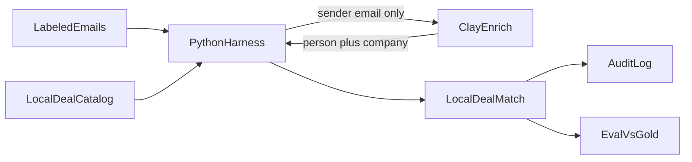

# Plan

Status: data model and explainer are in-repo. No matcher, Clay client, or eval harness yet.

## What we already decided

- **Job:** middle-of-funnel email-to-deal filing. An account and at least one open deal already exist. The product attaches a live email to the opportunity a human would pick.
- **Shape:** small labeled inbox, not a CRM workbench. Gold labels are how we know it works.
- **Clay’s role:** entity resolution — person and company from the sender. Not the deal pick.
- **Deal catalog stays local.** Sending open deals into Clay (logs, workspace, and any model prompt) is an unnecessary pipeline leak. The harness matches locally after Clay returns who/what the sender is.
- **Demo mode:** replay cached Clay responses so the loop runs without a live key. Live mode is opt-in.
- **Canonical model:** accounts, contacts, deals, deal-contact roles, emails, associations, gold labels, and audit events. See [schema/README.md](schema/README.md), [schema/er.md](schema/er.md), and [schema/canonical.schema.json](schema/canonical.schema.json). Salesforce/HubSpot names map onto these fields; they are not copied 1:1.

## Open before writing code

1. **Clay function contract.** Inputs: `from_email` (and maybe `subject` for context). Outputs: person name/title if found, company name/domain, plus a confidence. No deal list in the payload.
2. **Local matcher.** First version can be rules (exact email, domain, contact on deal, keyword/amount hints) with a scored shortlist. An LLM ranker on *our* side is optional later and still never sends the full pipeline to Clay.
3. **Thresholds.** Draft: auto-associate `>= 0.85`, review `0.50–0.84`, unmatched below that. Tune after the first eval run.
4. **Auth.** `CLAY_PUBLIC_API_KEY` and routine id in env. Windows uses the Public API, not the Clay CLI (Mac/Linux-only in beta).

## Build sequence

### 1. Dataset (conforms to the canonical schema)

- ~8–12 synthetic deals across a few accounts (at least one account with two open deals).
- ~12–15 emails: exact email match, Gmail/signature-only, ambiguous multi-deal account, lookalike company, thread follow-up, closed-deal trap, true negatives (no deal).
- Gold labels per email: `contact_id`, `account_id`, `deal_id` (nullable).

### 2. Clay enrich (person / company only)

- Document a Clay custom function recipe: enrich person from email, company from domain.
- Python client: `POST /public/v0/routines/{id}/run`, poll results.
- Cache by prompt/input hash. `eval --replay` reads the cache. Never log API keys.

### 3. Local association

- Resolve Clay’s person/company onto the local CRM contacts/accounts.
- Candidate deals from that account (open deals only).
- Score with explainable evidence. Do not call Clay with the deal list.

### 4. Audit log

Per email: Clay run id, enriched person/company, candidates, chosen deal, confidence, evidence, decision, latency.

### 5. Eval

Against gold: top-1 deal accuracy, precision/recall at the auto threshold, coverage (auto / review / unmatched), contact/account resolution accuracy, error buckets (wrong deal / missed deal / over-associate).

### 6. Thin inspector

CLI prints the metrics table. A small local page to open one email and see extraction, candidates, audit, and gold. Optional: reuse `docs/flow.html` as the landing explainer.

## Out of scope for v1

- Writing back to Salesforce/HubSpot.
- Building Clay tables from code (not supported).
- A polished CRM UI.
- Sending amounts, notes, or closed deals anywhere off-box.

## First implementation slice

After this plan is agreed in code review:

1. Add `data/crm.json` and `data/emails.json` that validate against `schema/canonical.schema.json`.
2. Add a Clay client with replay fixtures (fake enrich responses is enough to wire the rest).
3. Add local scoring + audit + a CLI `eval --replay`.
4. Wire live Clay last, once the function exists in the Clay UI.
