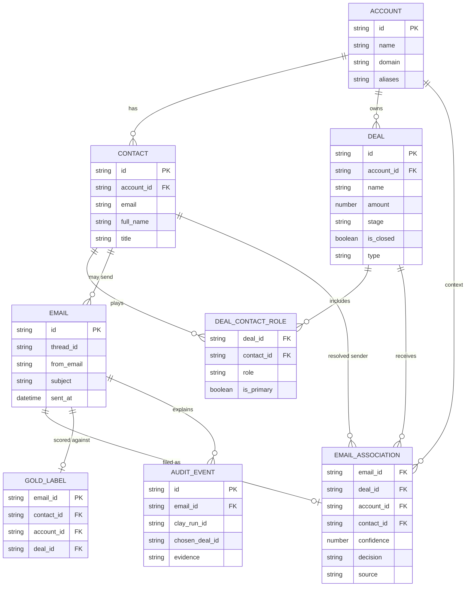

# Entity-relationship schema

Cardinality that matters for matching:

- One account, several open deals (renewal vs expansion) is the core ambiguity.
- Several contacts on one deal is normal; the sender may not be the primary contact.
- An email with no gold deal is a true negative, not a missing label.
